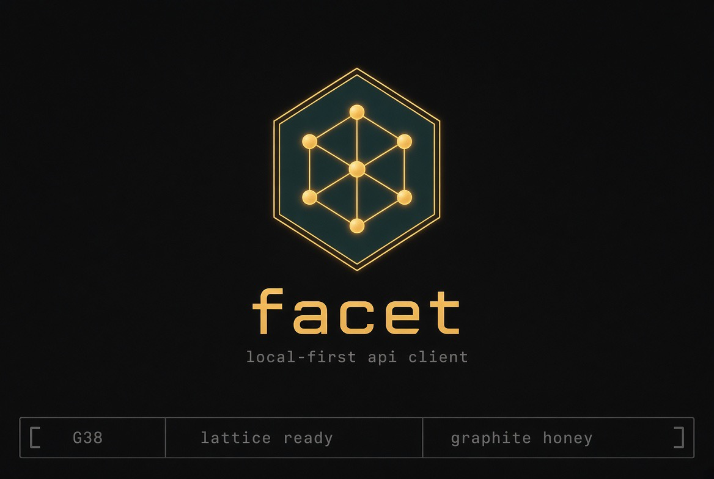

<p align="center">
  <a href="https://github.com/VirtualMachinist/facet">
    
  </a>
</p>

<h1 align="center">Facet</h1>

<p align="center">
  <strong>Native, local-first API client.</strong><br>
  The terminal-native fork of Probe, with Lattice run history.
</p>

<p align="center">
  <a href="https://github.com/VirtualMachinist/facet/actions/workflows/ci.yml"></a>
  <a href="https://github.com/VirtualMachinist/facet/releases/tag/v0.5.7"></a>
  <a href="https://rustup.rs"></a>
  <a href="LICENSE"></a>
  <a href="https://hedronite.com"></a>
</p>

<p align="center">
  <a href="#quick-start">Quick start</a> ·
  <a href="#what-you-get">What you get</a> ·
  <a href="#how-it-works">How it works</a> ·
  <a href="#status">Status</a> ·
  <a href="IMPLEMENTATION_PLAN.md">Roadmap</a> ·
  <a href="#contributing">Contributing</a>
</p>

<p align="center">
  Built by <a href="https://hedronite.com">Hedronite</a>'s <a href="https://github.com/VirtualMachinist">VirtualMachinist</a>.
  Fork of <a href="https://github.com/crizant/probe">Probe</a>.
  <em>The Facet mark is the graphite honey hex lattice.</em>
</p>

---

Facet is a fast, native, local-first API client. Collections stay OpenCollection YAML on disk; Git stays the sync layer. **Lattice** remembers what surrounds them — runs, bodies, timings, sessions — in local SQLite. A Ratatui TUI and an agent-friendly CLI sit on the same core.

It is for people who want a durable terminal workflow: deterministic JSON, content-addressed blobs, and SQL over history, without an account or hosted control plane. The `facet` binary coexists with `probe` on `PATH`.

**0.5.7** · OpenCollection YAML · Ratatui TUI · SQLite Lattice

## Quick start

Three steps to run your first request and query its history.

**1. Build and install.**

```bash
cargo build --release -p probe-cli -p facet-cli
export PATH="$PWD/target/release:$PATH"
```

**2. Run a request.**

Facet uses the exact same OpenCollection YAML as Probe.

```bash
facet request run ./api users/list-users.yml --environment development --json
```

**3. Explore your history.**

Lattice remembers the run automatically.

```bash
# View recent runs
facet history --json

# Query history with SQL
facet history --sql "SELECT status, count(*) FROM runs GROUP BY status"

# Extract a specific response body by hash
facet blob <sha256>
```

For the TUI, run `facet tui`.

## What you get

Everything below builds on Probe's core engine, running natively in your terminal.

| | Probe | Facet |
|---|---|---|
| Core Engine | Rust, fast, filesystem-first | Same core engine, cherry-pickable |
| Collections | OpenCollection YAML | Same YAML, 100% compatible |
| Interface | GPUI Desktop + CLI | Ratatui TUI (`facet tui`) + Agent CLI |
| History | In-memory session | **Lattice**: SQLite workspace & machine store |
| Binaries | `probe` | `facet` (coexists with `probe` on `PATH`) |
| Data | Ephemeral CLI runs | Persistent, queryable, content-addressed blobs |
| Output | Human-readable & JSON | Deterministic, versioned JSON optimized for agents |

### What stays upstream, on purpose

Facet rebuilds the terminal and history layers. The core domain and HTTP execution belong to Probe, and every place the two meet is written down rather than papered over. The full boundary is documented in [docs/FACET.md](docs/FACET.md).

| Upstream | On Facet |
|---|---|
| `probe-core`, `probe-cli` | Untouched. Fixes go upstream first. |
| GPUI Desktop | Out of default build. `cargo build --workspace` to include. |
| OpenCollection YAML | Canonical format. No proprietary database extensions. |
| CLI Contracts | `facet` delegates standard commands to `probe-cli` verbatim. |

## How it works

One rule drives the design: **YAML holds the collection; Lattice holds the history.** Terminal UI and run memory are Facet; shared core stays cherry-pickable.

- The `facet` binary coexists with `probe` on `PATH`. Collection files stay YAML; Git stays the sync layer. Lattice never holds the collection itself.
- **Lattice** uses SQLite beside the YAML (`.facet/lattice.db`) plus a machine store for secrets, sessions, and a cross-workspace run index.
- Agent CLI commands (`history`, `blob`, `gc`) are built for machine consumption. Metadata is cheap, and large bodies are content-addressed.
- Secrets are stored securely at rest using the OS keyring or XChaCha20-Poly1305 encryption.

<details>
<summary><strong>Repository map</strong></summary>

```
crates/cli/               # upstream probe-cli
crates/core/              # upstream probe-core
crates/desktop/           # upstream probe-desktop (excluded from default build)
crates/http/              # upstream HTTP client
crates/opencollection/    # upstream YAML parser
crates/facet/             # the facet binary
crates/lattice/           # run history, blobs, gc, sql
crates/facet-tui/         # Ratatui interface
docs/FACET.md             # Facet-specific documentation
AGENTS.md                 # project instructions
```

</details>

## Status

**G38 / lattice ready / graphite honey**

Facet is the working tree at 0.5.7; track `main`. The Lattice schema is versioned and migrated automatically.

- **Lattice**: Ready. SQLite/rusqlite is the default engine.
- **TUI**: Ready. Graphite Honey / Porcelain Honey themes via Ratatui.
- **Agent CLI**: Ready. Deterministic JSON and SQL querying.

HTTP is live. Lattice's week-1 loop (sessions, recall, replay, diff, secret
overlay, `--expect` / `--dry-run`) shipped 2026-09-07. Still folded from
[Probe's roadmap](https://rusty-probe.pages.dev): WebSocket, GraphQL, gRPC
streaming (Thread A, parked), user-defined theme files, git HEAD auto-tag,
and a TUI env editor. Details: [IMPLEMENTATION_PLAN.md](IMPLEMENTATION_PLAN.md).

## Contributing

Issues and pull requests are welcome. Start with [AGENTS.md](AGENTS.md) and [docs/FACET.md](docs/FACET.md). Roadmap: [IMPLEMENTATION_PLAN.md](IMPLEMENTATION_PLAN.md). Development practices for this tree: [docs/DEVELOPMENT.md](docs/DEVELOPMENT.md).

## Credits and license

Facet is built and maintained by [Hedronite](https://hedronite.com). Upstream lineage: [Probe](https://github.com/crizant/probe).

- **Facet-original crates** (`facet`, `lattice`, `facet-tui`): MIT License, Copyright 2026 Hedronite.
- **Upstream-derived crates and files**: Apache License 2.0 (Probe).

See [LICENSE](LICENSE) and [NOTICE](NOTICE). The Facet mark is Hedronite's.